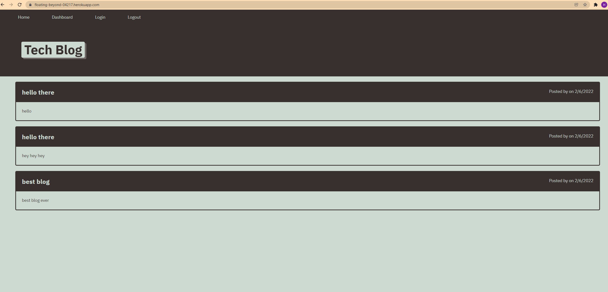

# Tech-Blog
## Badge 

## Description 
This application can be used to sign-in to make a post to the homepage about anything tech related. Then other users that have signed in can then click into that post and comment with there own opinions on the topic. You can use USERNAME: test along with PASSWORD: test for any testing purposes or sign in for yourself. 

## Table of Contents (Optional)
- [Demo](#demo)
- [License](#license)
- [Technologies](#technologies)
- [Usage](#usage)
- [E-mail](#e-mail)

## Demo

## License
MIT License
Permission is hereby granted, free of charge, to any person obtaining a copy of this software and associated documentation files the Software, to deal in the Software without restriction, including without limitation the rights to use, copy, modify, merge, publish, distribute, sublicense, and/or sell copies of the Software, and to permit persons to whom the Software is furnished to do so, subject to the following conditions. Click on Badge for more info.

## Technologies
- Bcrypt
- sequelize
- Express
- Handlebars
- Dotenv
- Mysql

## Usage
- Visit the Link below then just sign-up and start posting. 

## features
- Express for building the server
- mysql for building the tables.
- Sequelize for updating and requesting queries. 
- Handlebars to structure Front-end files
- Bcrypt for keeping user password safe.

## Questions
### Username
<a href="https://github.com/Skruphold">Skruphold</a>
### E-mail
<a href="mailto: Hunterco999@gmail.com">Hunterco999@gmail.com</a>